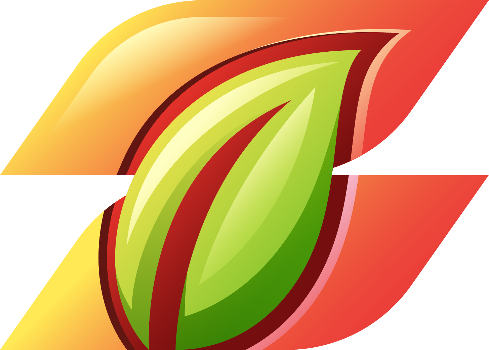
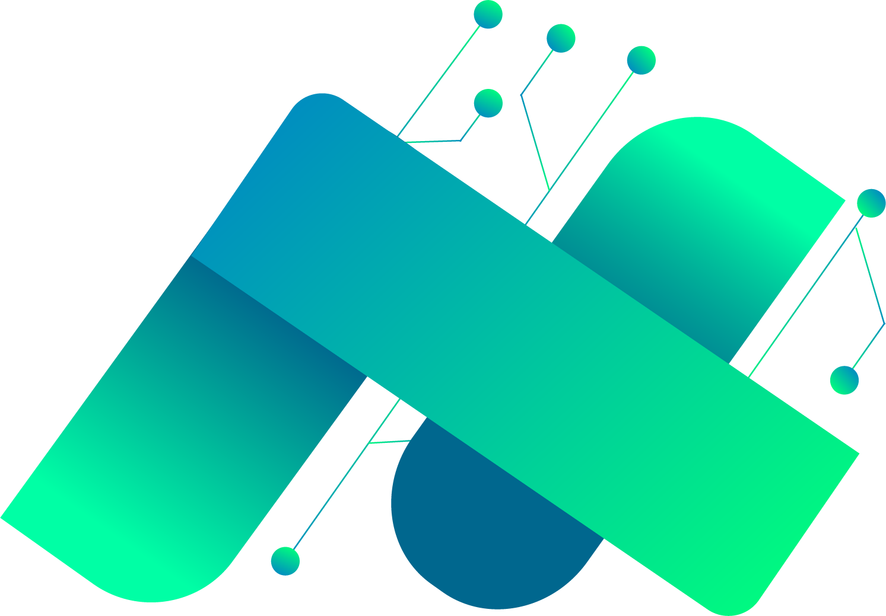

<h1 align="center">
   
  EcoBridge Document Portfolio
</h1>

  Welcome to the EcoBridge Document Portfolio repository! This repository contains comprehensive documentation and resources for the EcoBridge agriculture app prototype.

<h2 align="center">Contents</h2>

- **Assets:** Contains assets used for this repository. 
- **Coursera Certificates:** Certificates of the team members. 
- **User Manual:** Guide to navigating and maximizing the features of our app prototype. 
- **Part 1:** Initial phase documents. 
- **Part 2:** Second phase documents. 
- **Part 3:** Third phase documents. 
- **Part 4:** Final phase and completion documents. 

---

  

<h3 align="center">Team AnimaUX</h3>

- Aisha Nicole Dones ([GitHub](https://github.com/Aishie123)) 
- James Andrei Nadela ([GitHub](https://github.com/03-Andrew)) 
- Ryan Mark Diosay ([GitHub](https://github.com/rmdiosay)) 

